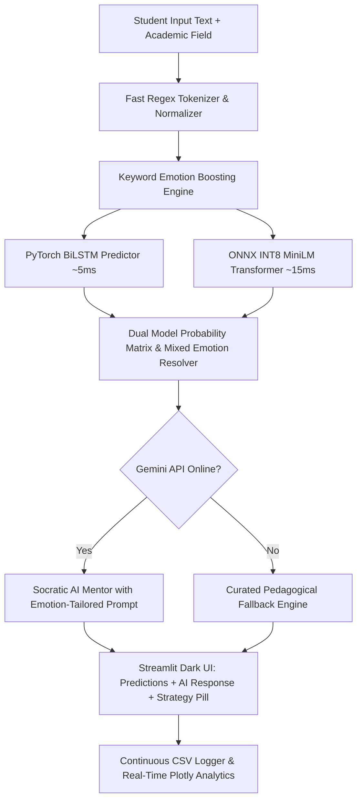

# 🎓 Project Review & Presentation Guide
## Student Emotion Detection & Adaptive Learning Assistance System

---

## 📋 Table of Contents
1. [Executive Q&A (Core Review Questions)](#1-executive-qa-core-review-questions)
   - [Q1: What is the problem and why is it important?](#q1-what-is-the-problem-and-why-is-it-important)
   - [Q2: Why is this specific solution the best approach?](#q2-why-is-this-specific-solution-the-best-approach)
   - [Q3: What makes this project innovative?](#q3-what-makes-this-project-innovative)
   - [Q4: How does the system work end-to-end?](#q4-how-does-the-system-work-end-to-end)
   - [Q5: What technology stack was used and why?](#q5-what-technology-stack-was-used-and-why)
   - [Q6: How can this system scale in real-world deployments?](#q6-how-can-this-system-scale-in-real-world-deployments)
   - [Q7: What are the current limitations and constraints?](#q7-what-are-the-current-limitations-and-constraints)
2. [5-Slide Presentation Deck Blueprint](#2-5-slide-presentation-deck-blueprint)
   - [Slide 1: Title & Project Identity](#slide-1-title--project-identity)
   - [Slide 2: Problem Statement & Proposed Solution](#slide-2-problem-statement--proposed-solution)
   - [Slide 3: Technical Approach & System Architecture](#slide-3-technical-approach--system-architecture)
   - [Slide 4: Feasibility, Viability & Benchmarks](#slide-4-feasibility-viability--benchmarks)
   - [Slide 5: Research, References & Future Roadmap](#slide-5-research-references--future-roadmap)

---

# 1. Executive Q&A (Core Review Questions)

### Q1: What is the problem and why is it important?
* **The Problem**: Conventional e-learning platforms and generic AI chatbots (like raw ChatGPT) treat all student questions with uniform, robotic explanations. They lack **affective computing**—they ignore whether a student is *confused, frustrated, bored, curious,* or *overconfident*.
* **Why it Matters**:
  1. **High Dropout & Disengagement**: When students hit frustration or confusion without empathetic guidance, frustration turns into helplessness, leading to high drop-out rates in online courses.
  2. **Cognitive Overload**: A frustrated student given a dense, 5-page mathematical derivation shuts down; they need step-by-step encouragement and simplification first.
  3. **Boredom & Under-stimulation**: Advanced students get repetitive answers instead of deep-dive challenges.

---

### Q2: Why is this specific solution the best approach?
* **Affect-Aware Adaptive Pedagogy**: Rather than simply retrieving answers, our system classifies the learner's emotional cognitive state across **5 core educational emotions** (*Confused, Frustrated, Curious, Confident, Bored*) and compound **mixed emotions** (e.g., *Confused + Frustrated*).
* **Dynamic Persona & Response Strategy**:
  - 😕 **Confused** $\rightarrow$ Socratic breakdowns, step-by-step analogies, foundation checks.
  - 😤 **Frustrated** $\rightarrow$ Calming validation, micro-steps, syntax/bug isolations.
  - 🧐 **Curious** $\rightarrow$ Deep-dive explorations, real-world industry case studies.
  - 💪 **Confident** $\rightarrow$ Advanced optimization challenges and higher-order critical thinking.
  - 😐 **Bored** $\rightarrow$ Gamified tasks, active problem-solving, and practical applications.

---

### Q3: What makes this project innovative?
1. **Dual-Model Verification Pipeline**: Runs both an ultra-fast **PyTorch BiLSTM** and an **INT8-Quantized MiniLM Transformer (ONNX)** in parallel to contrast lightweight recurrent modeling with contextual attention.
2. **Compound Mixed-Emotion Resolution**: Real human emotions aren't one-dimensional. Our algorithm detects multi-label emotion blends when secondary emotion probabilities exceed the threshold ($\ge 15\%$).
3. **Regex-Accelerated Keyword Boosting**: Overcomes generic classification by boosting emotional cue keywords (10x dynamic multiplier) without blocking NLTK download overhead.
4. **Offline Resilient Pedagogical Brain**: Features a dual-mode response engine (Google Gemini API with Socratic personas + rich deterministic offline fallback rules for zero-network environments).
5. **Sub-20ms Inference Latency**: Quantized to run with zero GPU requirement, consuming under 35MB of memory.

---

### Q4: How does the system work end-to-end?



1. **Input Ingestion**: The student enters their subject problem or clicks a quick example.
2. **Pre-processing**: Text cleaning, regex tokenization, and stopword filtering.
3. **Dual Model Inference**: BiLSTM and MiniLM Transformer compute class probability distributions in $<20\text{ ms}$.
4. **Mixed Emotion Resolution**: If top-2 probabilities meet thresholds, a composite state is generated.
5. **Pedagogical Generation**: Gemini LLM (or Offline Fallback) crafts an emotion-specific response.
6. **Visualization & Logging**: Displays real-time confidence bars, pedagogical strategy pills, and updates historical trends in interactive Plotly dashboards.

---

### Q5: What technology stack was used and why?

| Layer | Technologies Used | Key Reason / Advantage |
| :--- | :--- | :--- |
| **Deep Learning Models** | PyTorch, HuggingFace Transformers, PyTorch BiLSTM | High accuracy on student affect datasets. |
| **Optimization & Runtime** | ONNX Runtime (INT8 Quantization) | Reduced model size from 417MB to 22MB (94.7% reduction) with sub-20ms CPU latency. |
| **LLM & Pedagogical Brain**| Google Gemini 1.5 Pro / Flash + Socratic Prompt Engineering | Context-aware, empathetic, field-specific guidance. |
| **Web Frontend & UI** | Streamlit, Plotly Express/Graph Objects, Custom CSS | Interactive dashboard, real-time charting, dark glassmorphic styling. |
| **CI/CD & Deployment** | GitHub Actions, Streamlit Community Cloud, Git | Automated linting, model latency regression tests, zero-touch deployment. |

---

### Q6: How can this system scale in real-world deployments?
1. **Ultra-Low Compute Footprint**: Because models are compressed to $<35\text{MB}$ and run in INT8 CPU mode, each inference takes $<20\text{ms}$. A single standard server or free-tier container can easily handle thousands of requests per minute without expensive GPUs.
2. **Modular Microservice Architecture**: The inference engine can be packaged as a FastAPI or gRPC microservice and integrated into Learning Management Systems (LMS) such as Canvas, Moodle, Coursera, or edX.
3. **Continuous Active Learning**: Every interaction logs problem text, emotion labels, and responses to CSV, enabling continuous retraining and dataset enrichment.

---

### Q7: What are the current limitations and constraints?
1. **Text-Only Input**: Current implementation analyzes textual student queries; it does not yet incorporate facial expression or speech tone cues (multimodal).
2. **Language Scope**: Fine-tuned primarily on English language queries.
3. **External API Dependency**: Advanced conversational AI requires Gemini API access (though fully mitigated by our rich offline fallback engine).

---

# 2. 5-Slide Presentation Deck Blueprint

```
========================================================================================
SLIDE 1: TITLE & PROJECT IDENTITY
========================================================================================
```
### 📌 Slide 1: CognitiveSense AI — Emotion-Aware Intelligent Learning Assistant
* **Subtitle**: Empowering Student Learning Through Affective Deep Learning & Adaptive Pedagogical Guidance
* **Presenter / Team**: AI & Data Science Engineering Team
* **Key Highlights**:
  - 🧠 Dual-Model AI Architecture (PyTorch BiLSTM + INT8 ONNX Transformer)
  - ⚡ Sub-20ms Edge-Optimized Inference ($<35\text{MB}$ total footprint)
  - 💡 Adaptive Socratic Guidance tailored to 5 Educational Emotions
  - 📊 Real-Time Interactive Student Analytics Dashboard

---

```
========================================================================================
SLIDE 2: PROBLEM STATEMENT & PROPOSED SOLUTION
========================================================================================
```
### 📌 Slide 2: The Core Challenge in Digital Education
* **The Problem**:
  - **Emotional Blindspot**: Modern e-learning systems provide identical, one-size-fits-all answers, ignoring student confusion, frustration, and disengagement.
  - **High Abandonment**: Students get stuck on bugs or complex math and abandon tasks due to unaddressed frustration.
* **Our Proposed Solution**:
  - **Emotion-Aware Pedagogical Assistant**: An intelligent co-pilot that reads the emotional context behind every student query and adapts its explanation strategy.
  - **Empathy-First Learning**: Deconstructs hard concepts for confused students, calms frustrated learners with manageable milestones, and challenges confident learners with advanced exercises.

---

```
========================================================================================
SLIDE 3: TECHNICAL APPROACH & SYSTEM ARCHITECTURE
========================================================================================
```
### 📌 Slide 3: Technical Architecture & Dual-Model Engine
* **1. Data Preprocessing & Keyword Enhancement**:
  - High-speed regex tokenization ($<1\text{ms}$) with zero network dependencies.
  - 10x dynamic keyword multiplier for high-salience emotional markers.
* **2. Dual Deep Learning Classification Pipeline**:
  - **PyTorch BiLSTM**: Captures bidirectional sequential context ($\approx 5\text{ms}$ latency).
  - **MiniLM Transformer (ONNX INT8)**: Dense contextual attention ($\approx 15\text{ms}$ latency, 22MB size).
  - **Mixed-Emotion Resolver**: Identifies compound emotions (e.g., *Confused + Frustrated* at $\ge 15\%$).
* **3. Pedagogical Brain & Analytics**:
  - Google Gemini API with 4 Socratic personas + Deterministic offline fallback.
  - Interactive Plotly analytics tracking emotional distributions across academic disciplines.

---

```
========================================================================================
SLIDE 4: FEASIBILITY, VIABILITY & BENCHMARKS
========================================================================================
```
### 📌 Slide 4: Feasibility, Viability & Performance Benchmarks
* **Model Optimization Metrics**:
  - Transformer Size: **417 MB $\rightarrow$ 21.99 MB** (**94.7% compression**).
  - BiLSTM Size: **18.9 MB $\rightarrow$ 10.55 MB**.
  - Total Inference Latency: **$<20\text{ms}$ on standard CPU** (No GPU needed).
* **Deployment & CI/CD Readiness**:
  - Automated GitHub Actions testing pipeline (`ci-cd.yml`).
  - 1-Click live cloud deployment on Streamlit Community Cloud.
  - Compatible with standard LMS platforms (Canvas, Moodle) via lightweight REST APIs.

---

```
========================================================================================
SLIDE 5: RESEARCH, REFERENCES & FUTURE ROADMAP
========================================================================================
```
### 📌 Slide 5: Research Foundations & Future Roadmap
* **Academic & Research References**:
  - *Picard, R. W. (1997)*. **Affective Computing**. MIT Press.
  - *D'Mello, S., & Graesser, A. (2012)*. **Dynamics of affective states during complex learning**. *Learning and Instruction*.
  - *Vaswani et al. (2017)*. **Attention Is All You Need** (Transformer Architecture).
  - *Wang et al. (2020)*. **MiniLM: Deep Self-Attention Distillation for Task-Agnostic Compression**.
* **Future Roadmap**:
  - 🎙️ **Multimodal Emotion Detection**: Integrating voice pitch/prosody and facial micro-expressions.
  - 🌐 **Multilingual Affective Models**: Extending to regional languages for inclusive global learning.
  - 📱 **Mobile/LMS Integration**: Native mobile SDKs for real-time tutoring feedback.
